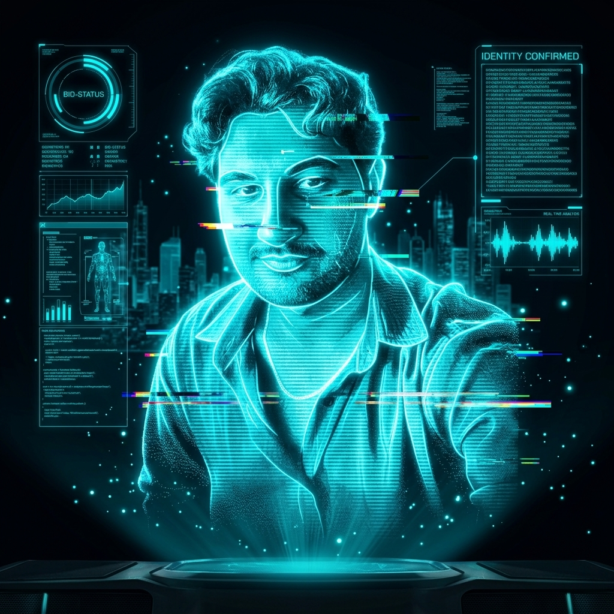

<table align="center" width="100%" style="border-radius: 10px; overflow: hidden; background-color: #0d1117;">
  <tr>
    <td width="35%" valign="top" style="padding: 15px;">
      <code>🔴 🟡 🟢&nbsp;&nbsp;&nbsp;&nbsp;&nbsp;&nbsp;&nbsp;&nbsp;&nbsp;&nbsp;&nbsp;&nbsp;&nbsp;berkan@portfolio: ~/hologram</code>
        
      
    </td>
    <td width="65%" valign="top" style="padding: 15px;">
      <code>🔴 🟡 🟢&nbsp;&nbsp;&nbsp;&nbsp;&nbsp;&nbsp;&nbsp;&nbsp;&nbsp;&nbsp;&nbsp;&nbsp;&nbsp;&nbsp;&nbsp;&nbsp;&nbsp;&nbsp;&nbsp;&nbsp;&nbsp;&nbsp;&nbsp;&nbsp;&nbsp;&nbsp;&nbsp;&nbsp;&nbsp;&nbsp;&nbsp;&nbsp;&nbsp;&nbsp;&nbsp;&nbsp;&nbsp;berkan — zsh — 120x34</code>
        
      <code>$ whoami</code>
      <h1>Hi 👋 I'm Berkan Öksüz</h1>
      <code>&gt; </code>
        
      <code>~/location &rarr;</code> Düzce, Turkiye 
      <code>~/focus &nbsp;&nbsp;&nbsp;&rarr;</code> AI workflows &ndash; full stack &ndash; predictive models 
      <code>~/github &nbsp;&nbsp;&rarr;</code> <a href="https://github.com/Berkanksz">github.com/Berkanksz</a> 
      <code>~/email &nbsp;&nbsp;&nbsp;&rarr;</code> <a href="mailto:berkanksz01@gmail.com">berkanksz01@gmail.com</a> 
       
      <code>SKILLS</code> 
      
      
      
      
       
      
      
      
       
      
      
        
      <code>$ connect --with</code> <a href="https://github.com/Berkanksz">GitHub</a> &bull; <a href="https://www.linkedin.com/in/berkan-öksüz-1a96b7219">LinkedIn</a> &bull; <a href="https://berkanksz.github.io/">Portfolio</a>
    </td>
  </tr>
</table>

 

  

